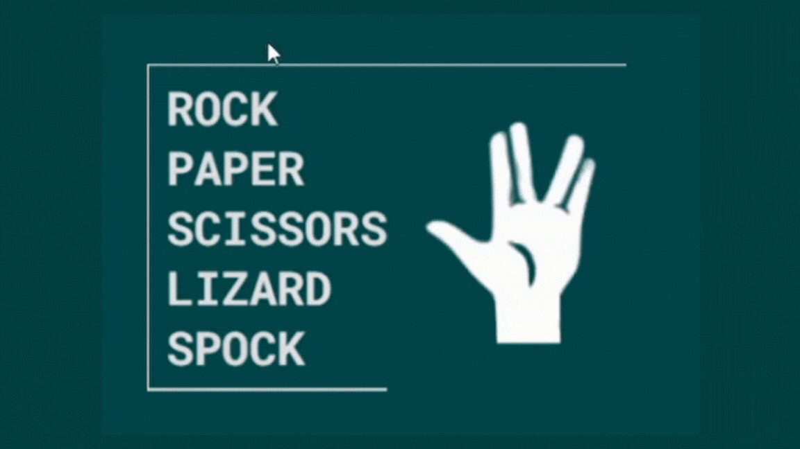

## 🖖🏼 ROCK PAPER SCISSORS LIZARD SPOCK 🖖🏼
>Have you ever heard of the game **rock-paper-scissors-lizard-Spock**?  It's an extension of the classic rock-paper-scissors, with more elements and much more nerdiness.  And now you can experience this game firsthand.  In this application, you can choose between the five options and let the game decide your fate.  **It's you and your luck against the computer!** 

## Preview

  

  

## Stacks used in the project

 
  
  
  
  
  
  
  
  
  
  
  

 

## Features and Details

### ReactJS
The project was created with **ReactJS**, streamlining the development process and ensuring a more organized and dynamic code.  

### React Router
The **React Router** was used to create and manipulate the application's routes.  

### Sass 
More organized and faster styling, using mixins to make the code more concise and dynamic.  

### Mobile First
The project's design was developed with a **mobile-first** approach, enabling the creation of a responsive page with minimal interventions through media queries.

  

   

### Animations
The project features **animations and hover events**, enhancing the creation of a dynamic, interactive, and intuitive interface.

  

   

## Running the aplication:

### `npm start`

